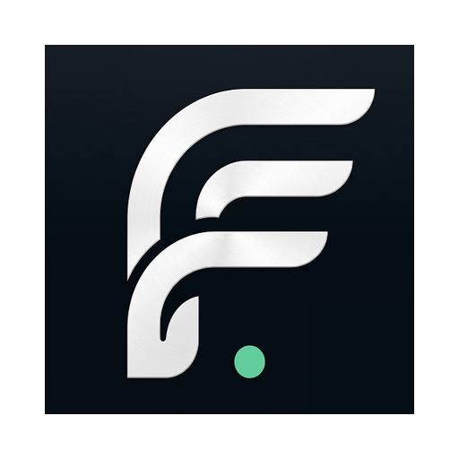

<p align="center">
  
</p>

<h1 align="center">FlowCapture</h1>

<p align="center">
  <strong>Turn real workflows into documentation — locally, with your own AI key.</strong>
</p>

<p align="center">
  <a href="https://github.com/Abhi6722/FlowCapture/releases"></a>
  <a href="https://github.com/Abhi6722/FlowCapture/actions/workflows/ci.yml"></a>
  
  
</p>

<p align="center">
  <a href="https://github.com/Abhi6722/FlowCapture/releases/latest">Download</a>
  ·
  <a href="https://github.com/Abhi6722/FlowCapture#quick-start">Quick start</a>
  ·
  <a href="website/docs/intro.md">Documentation</a>
  ·
  <a href="https://github.com/Abhi6722/FlowCapture/issues">Report a bug</a>
</p>

---

FlowCapture is an **open-source, local-first** desktop app that records your screen, mouse, keyboard, and window activity — then uses **your own AI API key** to produce step-by-step documentation, SOPs, and export-ready guides.

No cloud account required. Sessions stay on your machine in SQLite. You bring the AI provider (OpenAI, Claude, Gemini, or Ollama).

## Download

| Platform | Status | Link |
| --- | --- | --- |
| **macOS** (Apple Silicon) | Available | [Download v0.1.0 `.dmg`](https://github.com/Abhi6722/FlowCapture/releases/download/v0.1.0/FlowCapture_0.1.0_aarch64.dmg) |
| Windows / Linux | Build from source | See [Build from source](#build-from-source) |

> macOS may show an “unidentified developer” warning for unsigned builds. Open **System Settings → Privacy & Security** and choose **Open Anyway**, or right-click the app and select **Open**.

## Features

- **Rich capture** — screen video, event-driven screenshots, mouse, keyboard, and window tracking
- **Local-first storage** — SQLite on your machine; optional redaction before AI processing
- **BYOK AI** — OpenAI, Claude, Gemini, and Ollama; you control keys and models
- **Multi-stage pipeline** — timeline compression, screenshot selection, writing, and review
- **Exports** — Markdown, styled HTML, PDF, and video
- **Session replay** — step through captured workflows before generating docs

## How it works

1. **Record** — perform your workflow; FlowCapture captures events and screenshots as you go.
2. **Review** — inspect the compressed timeline and replay steps in the app.
3. **Generate & export** — run the AI pipeline, edit the Markdown, then export in your preferred format.

## Quick start

1. Install FlowCapture from [Releases](https://github.com/Abhi6722/FlowCapture/releases) (or [build from source](#build-from-source)).
2. Open **Settings** and enable an AI provider with your API key.
3. Click **Start Recording** on the home screen and complete a workflow.
4. Use the overlay to **Mark Step** (`Cmd+Shift+M` on macOS) or **Stop** when finished.
5. Open the session, click **Generate Documentation**, review the output, and export.

For a full walkthrough, see [website/docs/getting-started/quick-start.md](website/docs/getting-started/quick-start.md).

## Build from source

### Prerequisites

| Tool | Version |
| --- | --- |
| [Node.js](https://nodejs.org/) | 20+ |
| [Rust](https://rustup.rs/) | stable |
| macOS | Xcode Command Line Tools |

### Setup

```bash
git clone https://github.com/Abhi6722/FlowCapture.git
cd FlowCapture
npm install
npm run tauri dev
```

First launch compiles the Rust backend and may take several minutes.

### Production build

```bash
npm run tauri:build
```

Packaged artifacts are written to:

```text
src-tauri/target/release/bundle/
```

## Development

| Command | Description |
| --- | --- |
| `npm run tauri dev` | Run the desktop app with hot reload |
| `npm run build` | Build the app frontend |
| `npm run tauri:build` | Build a production desktop bundle |
| `npm run test:rust` | Run Rust tests |
| `npm run website:dev` | Run the marketing site and docs (port 4321) |
| `npm run website:build` | Build the static website |

### Project layout

```text
FlowCapture/
├── src/              # React app (Tauri webview)
├── src-tauri/        # Rust backend (recording, AI, exports, SQLite)
├── website/          # Marketing site + documentation
└── docs/             # Legacy planning notes (PRD, dogfooding)
```

## Documentation

Full docs live in [`website/docs/`](website/docs/intro.md):

- [Installation](website/docs/getting-started/installation.md)
- [User guide](website/docs/guide/recording.md)
- [AI providers](website/docs/reference/ai-providers.md)
- [Development setup](website/docs/development/local-setup.md)

Run the docs locally:

```bash
npm run website:dev
# http://localhost:4321/docs/intro
```

## Contributing

Contributions are welcome. To get started:

1. Fork the repo and create a branch from `main`.
2. Make your changes and run `npm run build` and `npm run test:rust`.
3. Open a pull request with a clear description of what changed and why.

See [website/docs/development/local-setup.md](website/docs/development/local-setup.md) for environment details.

## Platform notes

- **macOS** — in-app screen recording at 15 fps; requires Screen Recording and Accessibility permissions.
- **Windows / Linux** — supported in development builds; periodic frame capture to MP4 when ffmpeg is available.
- **PDF export** — uses headless Chrome or `wkhtmltopdf` when installed on the system.

## License

This project is licensed under the MIT License.

---

<p align="center">
  Built with <a href="https://tauri.app">Tauri</a> · React · Rust
</p>
